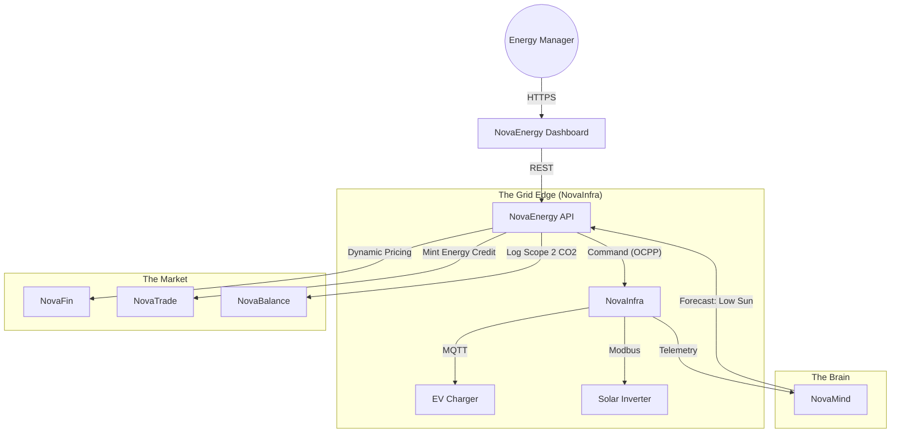

# ⚡ NovaEnergy

> **The Operating System for the Renewable Grid.**
> Digital management of Virtual Power Plants (VPP), Vehicle-to-Grid (V2G) coordination, and Guarantee of Origin (GO) tracking.

[](https://www.google.com/search?q=https://github.com/novaeco-tech/novaenergy/actions)
[](https://opensource.org/licenses/MIT)
[](https://www.google.com/search?q=https://energy.novaeco.tech)

**NovaEnergy** is the Vertical Sector responsible for the **Power Layer** of the ecosystem. While `NovaMaterial` tracks atoms, **NovaEnergy** tracks electrons. It connects decentralized energy resources (Solar Panels, Batteries, EV Chargers) to balance the grid and certify the "Greenness" of industrial activities.

It acts as the bridge between the physical grid physics (Voltage/Frequency) and the economic market (Spot Prices/Credits).

-----

## 🎯 Value Proposition

The circular economy is energy-intensive (recycling takes power). **NovaEnergy** ensures that this power is sustainable and reliable:

1.  **Grid Balancing:** Orchestrating thousands of small batteries (e.g., `NovaMobility` trucks) to stabilize the grid when the sun stops shining.
2.  **Scope 2 Auditing:** Proving exactly *when* energy was used. A factory running at noon (Solar) has a lower carbon footprint than one running at midnight (Coal).
3.  **Monetization:** Allowing prosumers (houses with panels) to sell excess energy peer-to-peer via `NovaTrade`.

-----

## 🏗️ Architecture (The Virtual Power Plant)

NovaEnergy acts as a **Virtual Power Plant (VPP)** controller. It aggregates telemetry from `NovaInfra` and sends control signals back to inverters and chargers.



### Integrated Services

  * **[NovaInfra](https://www.google.com/search?q=https://infrastructure.novaeco.tech):** The hardware abstraction layer. Speaks industrial protocols (OCPP 2.0, Modbus TCP, SunSpec) to talk to inverters and batteries.
  * **[NovaMind](https://www.google.com/search?q=https://mind.novaeco.tech):** The forecaster. Predicts solar generation based on weather data and predicts demand peaks based on factory schedules in `NovaMake`.
  * **[NovaMobility](https://www.google.com/search?q=https://logistics.novaeco.tech):** The battery provider. NovaEnergy negotiates with NovaMobility to discharge parked delivery trucks into the grid (V2G) during price spikes.
  * **[NovaBalance](https://www.google.com/search?q=https://balance.novaeco.tech):** The auditor. It receives the precise "Carbon Intensity" of the grid for every hour of operation to calculate accurate LCA.

-----

## ✨ Key Features

### 1\. Vehicle-to-Grid (V2G) Orchestrator

Turns EVs into mobile power plants.

  * **Logic:** "Truck A is plugged in at Warehouse B. It has 80% charge but isn't scheduled for a route until 6 AM tomorrow."
  * **Action:** "Discharge 10% of battery to the warehouse to lower peak demand charges."
  * **Settlement:** Pays the truck owner (`NovaMobility`) via `NovaFin`.

### 2\. "Follow the Sun" Automation

Demand Response for Industry.

  * Integration with **NovaMake** and **NovaRecycle**.
  * **Signal:** "Renewable saturation is high. Electricity is cheap."
  * **Action:** Triggers the recycling shredders and 3D printers to start their heavy jobs *now*.

### 3\. Guarantee of Origin (GO) Tracking

Eliminates "Greenwashing" in energy claims.

  * Mints a token in `NovaTrade` for every MegaWatt-hour (MWh) of solar produced.
  * Burns the token when that MWh is consumed by a factory, ensuring no double-counting of green credits.

### 4\. Smart Meter Analytics

Detects anomalies and efficiency opportunities.

  * **Pattern Recognition:** Identifies "Vampire Loads" (machinery left on at night) using `NovaMind` anomaly detection.
  * **Alert:** Sends a "High Consumption Alert" to the facility manager via the Dashboard.

-----

## 🚀 Getting Started

We use **DevContainers** to provide a consistent development environment.

### Prerequisites

  * Docker Desktop
  * VS Code (with Remote Containers extension)

### Installation

1.  **Clone the repo:**
    ```bash
    git clone https://github.com/novaeco-tech/novaenergy.git
    cd novaenergy
    ```
2.  **Open in VS Code:**
      * Run `code .`
      * Click **"Reopen in Container"** when prompted.
3.  **Start the Sector:**
    ```bash
    make dev
    ```
      * **Grid Dashboard:** http://localhost:3000
      * **API:** http://localhost:8000/docs

### Configuration (`.env`)

```ini
# Grid Config
GRID_REGION=EU_ENTSOE_DE_LU
MAX_EXPORT_LIMIT_KW=50

# Integrations
NOVAINFRA_URL=http://novainfra-api:8000
NOVAMIND_URL=http://novamind-api:50051
NOVAFIN_URL=http://novafin-api:8000
```

-----

## 📂 Repository Structure

This is a Monorepo containing the sector's specific logic.

```text
novaenergy/
├── api/                # Python/FastAPI (Domain Logic)
│   ├── src/
│   │   ├── vpp/        # Virtual Power Plant aggregation logic
│   │   ├── ocpp/       # EV Charging logic (Smart Charging Profiles)
│   │   └── trading/    # Spot price fetching and bid generation
├── app/                # React/Next.js Frontend (Energy Dashboard)
│   ├── src/
│   │   ├── flow-chart/ # Sankey diagrams of energy flow
│   │   └── control/    # Manual override switches for assets
├── website/            # Documentation (Docusaurus)
└── tests/              # Integration tests
```

-----

## 🧪 Testing

We use **Grid Simulation** for testing.

  * **V2G Test:** `make test-v2g`
      * Simulates a fleet of 50 EVs plugging in. Asserts that the system prioritizes charging the ones with urgent departure times.
  * **Blackout Test:** `make test-island`
      * Simulates a grid failure event. Verifies that the system switches local batteries to "Island Mode" to keep critical `NovaHealth` assets running.

-----

## 🤝 Contributing

We need contributors with backgrounds in **Electrical Engineering**, **Smart Grids**, and **IoT Protocols (OCPP, MQTT)**.
See [CONTRIBUTING.md](https://www.google.com/search?q=../.github/CONTRIBUTING.md) for details.

**Maintainers:** `@novaeco-tech/maintainers-sector-novaenergy`